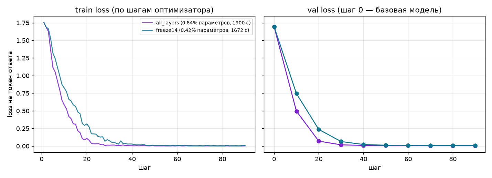

# ДЗ5: разбор пяти дефектов LoRA-обучения

## Условия эксперимента

Используется собственный географический датасет Wikidata v2 из ДЗ3,
токенизированный в ДЗ4 моделью `Qwen/Qwen3-0.6B`. Входы — непосредственно
`../HW4/data/tokenized/train.pt` и `val.pt`: 2 872 и 360 примеров, 732 378 и
91 922 токена соответственно. Лимит длины 330, левый динамический padding,
`labels=-100` на промпте и padding, thinking выключен. Проверены размеры и
маски всех примеров; пять вопросов сравнения принадлежат validation, их
сущностей нет в train.

Машина: Apple M3 Pro, 36 ГБ RAM, MPS, базовые веса bf16. LoRA r=8, alpha=16,
dropout=0.05 на семи проекциях внимания и MLP. Один полный проход по train,
batch=4, grad_accum=8, эффективный батч 32, 90 шагов. Последние 24 примера
образуют неполную группу и также обновляют адаптер. Увеличение эффективного
батча относительно курсового примера сокращает число полных оценок val для
собственного датасета большего размера; оба варианта используют один конфиг.
Packing-файлы не используются: в этом цикле нет маски между примерами бина.

## 1. Обучение вслепую: валидация отсутствовала

**Причина.** Функция `evaluate` существовала, но цикл её не вызывал:
`base_val=None`, список `curve_val` всегда пустой. По одному train loss нельзя
отличить улучшение на новых сущностях от запоминания train. Нельзя было даже
сравнить итог с базовой моделью: исходная точка отсутствовала.

**Исправление.** На шаге 0 считается loss неизменённой базы; LoRA B изначально
нулевая. Затем оценка проводится каждые 10 шагов оптимизатора и на последнем
шаге. Она использует все 360 val-примеров без перемешивания, `no_grad` и
`eval`; после неё восстанавливается предыдущий режим модели. Loss взвешен
числом незамаскированных токенов после сдвига causal labels, а не числом
батчей. Время оценки записывается отдельно от времени обучения.

**Подтверждение.** Исходный val loss полного набора равен 1.6966. У каждого варианта сохранены 10 точек val: 0, 10, …, 90. Итоговый val
равен 0.0058 у all_layers и 0.0073 у freeze14; обе кривые снижаются без
роста в конце эпохи. Числа полного эксперимента приведены в таблице ниже.

## 2. Завышенный learning rate

**Причина.** В выданном `params.yaml` был `lr=1e-2`: это в 50 раз выше
стартового значения `2e-4` из лекции. Масштаб LoRA alpha/r равен двум, поэтому
чрезмерные обновления особенно быстро нарушают полезное поведение базы.
Сохранение адаптера само по себе не подтверждает сходимость: обучение может
закончиться с конечным, но намного худшим loss.

**Исправление.** Learning rate снижен до `2e-4` только в конфиге; cosine
scheduler, warmup и clipping градиентов сохранены. Накапливаются суммы loss
по токенам ответа, затем градиенты нормируются числом токенов всей группы.
Так корректно обрабатываются разные длины ответов и последняя неполная
группа; все 2 872 примера участвуют в одной эпохе.

**Подтверждение.** В пробном прогоне на трёх шагах train loss составил
1.7555 → 1.6879 → 1.4863, val на первых восьми примерах — 1.6135 → 1.2173.
Это проверка работоспособности, отдельно от полного эксперимента.

## 3. freeze14 игнорировался

**Причина.** `lora_config` принимала `n_layers` и `freeze_first`, но не
использовала их. Оба варианта создавали LoRA на всех 28 слоях. Название
папки и поле `freeze_first` в метриках были разными, а обучаемая структура
оставалась одной и той же, поэтому вывод о пользе заморозки был недостоверен.

**Исправление.** `layers_to_transform=list(range(freeze_first, n_layers))`
явно ограничивает установку адаптеров. Значение вне диапазона слоёв вызывает
ошибку. У all_layers список 0–27, у freeze14 — 14–27. Базовые веса PEFT
замораживает в обоих случаях; нижние слои freeze14 не содержат LoRA-матриц.

**Подтверждение.** all_layers обучает 5 046 272 параметра, freeze14 —
2 523 136. В сохранённом adapter_config freeze14 список слоёв равен 14–27;
веса адаптера содержат только эти слои. Обучение заняло 1899.8 и 1671.6 с
соответственно, итоговый val — 0.0058 и 0.0073. Подробные размеры и память
приведены в таблице ниже.

## 4. Адаптер зависел от окружения автора

**Причина.** Сохранялись только LoRA-веса и adapter_config. Токенизатор и chat
template отсутствовали. `load_adapter_tokenizer` скрывала дефект, загружая
токенизатор базы по глобальному конфигу, вместо чтения переданной папки.
На машине автора это работало благодаря HF-кешу; передать одну папку
другому человеку было недостаточно.

**Исправление.** После `model.save_pretrained` вызывается
`tokenizer.save_pretrained` в ту же папку. Сохраняется и шаблон чата.
Сравнение загружает токенизатор непосредственно из адаптера с
`local_files_only=True`; имя базы получает из adapter_config. Обе генерации
используют этот токенизатор, `enable_thinking=false` и greedy-декодинг.
Эмбеддинги и lm_head исключены из сохранения; modules_to_save остаётся пустым.

**Подтверждение.** Итоговый all_layers с токенизатором занимает 30.20 МиБ,
из них LoRA-веса — 19.30 МиБ; freeze14 с токенизатором — 20.55 МиБ. Полный словарь весов базы не сохраняется.
Офлайн-проверка копирует только папку адаптера во временное место; базовые
веса и установленные зависимости должны быть доступны заранее, как
предусмотрено выданным check.sh. Все пять ответов копии адаптера при
офлайн-загрузке совпали дословно с исходным `make compare` — проверка 4 зелёная.

## 5. Seed не применялся к обучению

**Причина.** `runtime.set_seed` была написана, но в `train.main` не вызывалась.
Локальный `random.Random(seed)` фиксировал только порядок примеров. Матрица
LoRA A и dropout использовали незафиксированное состояние генераторов,
поэтому одинаковый YAML не давал одинаковую кривую.

**Исправление.** Seed 42 применяется до загрузки модели и установки LoRA:
Python, NumPy, PyTorch, включая генераторы ускорителей. Дополнительно включены
детерминированные операции PyTorch. При сравнении тоже выставляется seed;
модели переводятся в eval, генерация жадная. Точные версии зависимостей
зафиксированы в `uv.lock`; переносимость побитового результата между разными
бэкендами или версиями библиотек не утверждается.

**Подтверждение.** Выданная проверка дважды выполняет три шага с одним
конфигом и требует равенства округлённых train-кривых. Оба независимых
прогона дали `[1.7555, 1.6879, 1.4863]`; проверка 5 зелёная. Это совпадает
с отдельной проверкой восстановления после прерывания.

## Прослеживаемость и гигиена

Отпечаток обучения учитывает код, конфигурацию, uv.lock и содержимое обоих
входных тензоров. Изменение данных или окружения делает старые метрики
неактуальными. DVC описывает обе стадии train, compare и построение графика,
включая зависимости от кода и входов ДЗ4. Адаптеры, тензоры, метрики JSON,
окружение и логи исключены из Git.

`tests/check.sh` не изменён: SHA-256 начинается с `06a02208c1f0`.
Все девять проверок `make check` прошли. Полный фактический вывод сохранён
в `docs/check.txt`, включая исходный отпечаток скрипта.

Источники технических решений: локальные лекции 1–5 и задание ДЗ5;
[PEFT LoraConfig](https://huggingface.co/docs/peft/package_reference/lora),
[воспроизводимость PyTorch](https://docs.pytorch.org/docs/stable/notes/randomness.html),
[карточка Qwen3-0.6B](https://huggingface.co/Qwen/Qwen3-0.6B).

## Восстановление после перерыва

Помимо пяти дефектов, цикл сохраняет атомарную контрольную точку каждые
10 шагов. Она содержит только LoRA-параметры, состояния AdamW и scheduler,
состояния генераторов Python/NumPy/PyTorch/MPS, кривые и положение в эпохе.
При совпадении отпечатка кода, окружения и данных повторный запуск продолжает
тот же эксперимент; несовместимая контрольная точка не используется.

Проверено реальное прерывание: прогон на три шага остановлен на шаге 2,
затем продолжен отдельным процессом. В сравнении с непрерывными тремя шагами
совпали train-кривая `[1.7555, 1.6879, 1.4863]`, обе точки val
`[1.6135, 1.2173]`, счётчики примеров и токенов, а также все **392 тензора**
LoRA-адаптера побитово. Это проверяет восстановление dropout и оптимизатора,
а не только чтение сохранённых весов. Контрольные точки лежат вне папки
передаваемого адаптера и не увеличивают её размер.

## Итог двух полных прогонов

Оба варианта прошли одну полную эпоху: 718 микробатчей, 90 обновлений,
2 872 примера и 732 378 токенов; `resumes=0` у обоих финальных прогонов.
Все оценки используют 360 val-примеров. Память измеряется через
`torch.mps.driver_allocated_memory`: максимум замеров после микробатчей
и оценки, включая выделенную драйвером память. Размеры ниже — МиБ (2²⁰ байт).

| Метрика | all_layers | freeze14 |
|---|---:|---:|
| Обучаемые параметры | 5046272 | 2523136 |
| Доля параметров | 0.839% | 0.421% |
| Шаги | 90 | 90 |
| Val до обучения | 1.6966 | 1.6966 |
| Val в конце | 0.0058 | 0.0073 |
| Train loss последнего шага | 0.0029 | 0.0057 |
| Обучение без оценки, с | 1899.8 | 1671.6 |
| Оценки во время обучения, с | 537.7 | 477.9 |
| Первичная оценка базы, с | 60.0 | 52.2 |
| Пик памяти, МиБ | 13533.2 | 13275.1 |
| Папка адаптера с токенизатором, МиБ | 30.2 | 20.55 |
| Токенов/с обучения | 385.5 | 438.1 |

В этом эксперименте freeze14 уменьшил обучаемые параметры вдвое, время
обучения — на 12.0%, папку адаптера — на 32.0%. Пик памяти снизился
на 1.9%: базовые веса, активации и кэш Metal остаются в обоих вариантах.
У all_layers val loss немного ниже, а достижение низкого loss происходит
раньше. Числа относятся к этому запуску и выбранным батчам 4/8.

## Что показали пять фиксированных вопросов

Полные карточки и неизменённые ответы сохранены в `compare.md`. Адаптер
добавляет идентификатор источника, оговорку о дате снимка и ожидаемый формат
координат. У базы на вопросе о Сараево обозначения полушарий некорректны;
адаптер выдаёт северную широту и восточную долготу. На вопросе о населении
база отвечает только числом, адаптер явно говорит о снимке 2026-09-17.

Генерация также показывает ограничение: в ответе о Либерии адаптер написал
`Лiberия`, смешав кириллицу и латиницу. Этот ответ сохранён как получен.
Низкий teacher-forced val loss не гарантирует безошибочную генерацию.
Пять вопросов подтверждают изменение поведения после подключения LoRA;
полноценная оценка качества требует отдельного набора и критериев.
